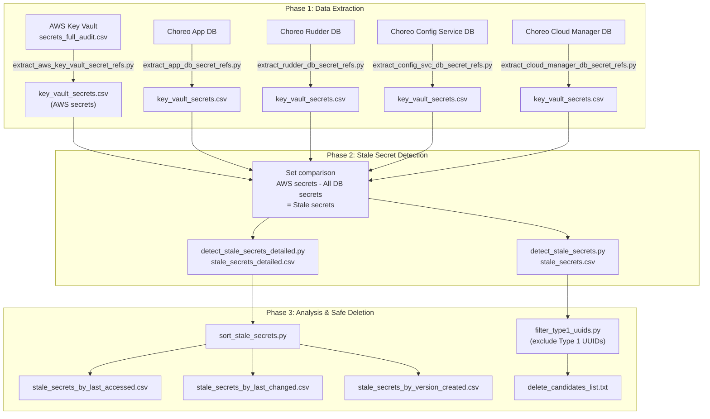

# choreo-python-scripts

Python scripts for processing and analyzing Choreo secrets across AWS Key Vault and various database sources.

## Overview

This repository contains tools to audit, analyze, and identify stale secrets across multiple data sources including AWS Key Vault and various Choreo databases (App DB, Cloud Manager DB, Configuration Service DB, and Rudder DB).

## Directory Structure

### `process_secrets/aws_key_vault/`
- Extracts AWS Key Vault secret references
- Contains full audit data with detailed metadata (LastAccessedDate, LastChangedDate, Tags, Versions, etc.)

### `process_secrets/choreo_app_db/`
- Extracts key vault secret references from the Choreo App database

### `process_secrets/choreo_cloud_manager_db/`
- Extracts key vault secret references from the Cloud Manager database

### `process_secrets/choreo_configuration_service_db/`
- Extracts key vault secret references from the Configuration Service database

### `process_secrets/choreo_rudder_db/`
- Extracts key vault secret references from the Rudder database

### `process_secrets/stale_secrets/`
- **Primary tool for stale secret detection and analysis**
- Contains scripts to identify secrets in AWS Key Vault that are not referenced in any database
- Provides detailed audit information and sorting capabilities

## High-Level Architecture

The diagram below shows how data flows through the pipeline — from extraction to stale secret detection to safe deletion candidate filtering.

## Key Features

- **Stale Secret Detection**: Identifies secrets present in AWS Key Vault but not used in any database
- **Detailed Auditing**: Provides comprehensive metadata including access dates, change dates, and version information
- **Multi-source Analysis**: Compares secrets across multiple database sources
- **Flexible Sorting**: Sort results by various date criteria (last accessed, last changed, version created)
- **Version Tracking**: Tracks multiple versions of secrets (AWSCURRENT, AWSPREVIOUS)

## Usage

See individual README files in each subdirectory for specific script usage and SQL queries.